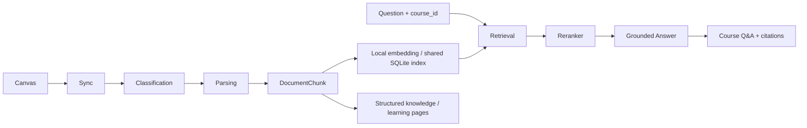

# StudyFlow

StudyFlow is a local-first AI course knowledge system that syncs Canvas materials, classifies resources, builds multilingual semantic indexes, and provides grounded course Q&A with source citations.

Built for a student's local workflow: **Dashboard → Course → Week → Original Materials / Knowledge / Q&A**. Files, SQLite and search models stay local. Configured LLM features send selected course text to an external provider; local-first does not mean all inference is offline.

## Problem

Course materials are scattered across Canvas Modules, Files and Pages. Inconsistent filenames make lectures, tutorials and supplementary readings difficult to organize. Finding a document is also not the same as finding the page that answers a question—especially with Chinese questions over English slides.

StudyFlow connects discovery, incremental processing, evidence retrieval and source-linked answers in one learning workflow.

## Core Features

- **Canvas course sync:** read-only direct-file and Page-linked discovery, active-semester scope, deduplication, progress, cancellation and per-resource error isolation.
- **Lecture / Tutorial / Other classification:** robust metadata scoring, bounded existing-content fallback and optional, explicitly budgeted LLM fallback. Normal sync does not make paid classification calls.
- **Manual classification override:** persisted user choices take precedence over automatic sync.
- **Incremental sync:** unchanged files skip download, parsing and knowledge generation; reading/reference materials are intentionally ignored by default.
- **Document parsing and chunking:** PyMuPDF page extraction, page-bound DocumentChunks, parsing warnings and original-page links. Generated knowledge is stored separately from retrieval evidence.
- **Multilingual embeddings and cross-encoder reranking:** local semantic retrieval over original chunks, with strict course isolation and optional resource-type filtering.
- **Multi-course incremental indexing:** shared SQLite vectors, content/model compatibility checks, automatic post-sync indexing and existing-course backfill.
- **Grounded Course Q&A:** one question/answer UI, bounded context, abstention and validated source/page citations. Source metadata comes from the database, not the model.

## Architecture



Classification can use existing parsed text when metadata is ambiguous. Retrieval uses **DocumentChunk**, not generated summaries. Role-only edits use live metadata and do not require re-embedding.

Engineering decisions worth inspecting:

- **Evidence-level evaluation:** distinguish retrieving the right PDF from retrieving an answer-supporting page.
- **Controlled experiments:** preserve Gold labels; compare hygiene, multilingual embeddings and reranking separately; report regressions.
- **Incremental identity:** check content/source hashes and model/version instead of using timestamps alone.
- **Course isolation and source checks:** filter in SQL and revalidate source ownership/content around generation.

See [Architecture](docs/architecture.md), [RAG pipeline](docs/rag-pipeline.md) and [Evaluation](docs/evaluation.md).

## Evaluation

These are small development experiments—not unseen accuracy or guarantees about arbitrary courses.

| Evaluation | Observed result | Scope |
|---|---|---|
| V2.1 classification baseline | 27/30 (90%) | 30 labeled metadata samples |
| V2.2a classification regression | 30/30 (100%) | Same development/regression set; independent holdout pending |
| V0.4 Resource Hit@1 / @3 / @5 | 90% / 100% / 100% | 10 frozen questions, one course, 629-chunk snapshot |
| V0.4 Evidence Hit@1 / @3 / @5 | 90% / 100% / 100% | Correct resource and a reviewed supporting page |
| Backend regression | 884 passed, 1 skipped | Local verification, 2026-10-07 |
| Frontend regression | 58 passed | Local verification, 2026-10-07 |
| ESLint / TypeScript / production build | Passed | Local verification, 2026-10-07 |

Multilingual embeddings improved Evidence Hit@3 from 80% to 100%, while Hit@1 fell from 40% to 30%. Reranking the same five candidates then raised Hit@1 to 90%, retaining Hit@3/5 at 100%. [The experiment sequence](docs/evaluation.md) includes the earlier hygiene regression and measurement limits. These results do not measure answer factuality or the newer classification fallback pipeline.

## Multi-course Support

All courses share `chunk_embeddings`. Each vector joins through DocumentChunk → Resource → Week → Course. Retrieval never silently searches a different course.

- **New:** create a missing embedding.
- **Changed:** regenerate incompatible content/source/model versions or invalid vectors.
- **Skipped:** reuse unchanged, compatible vectors.
- **Stale/deleted:** exclude invalid entries and clean obsolete vectors; normal chunk deletion cascades.

Q&A is ready only when all usable course chunks have compatible vectors. Failed indexing preserves synced materials. Sync indexes included courses automatically; `python -m app.index_course --all` backfills historical courses. See [Multi-course indexing](docs/multi-course-indexing.md).

## Tech Stack

| Layer | Implementation |
|---|---|
| Backend | Python 3.12, FastAPI, Pydantic, SQLAlchemy, SQLite |
| Frontend | Next.js App Router, React, TypeScript, Tailwind CSS |
| Documents | PyMuPDF |
| Local retrieval | FastEmbed / ONNX Runtime; `sentence-transformers/paraphrase-multilingual-MiniLM-L12-v2` (384 dimensions) |
| Local reranking | `cross-encoder/mmarco-mMiniLMv2-L12-H384-v1`, quantized ONNX on CPU |
| Generation | Existing LLMProvider with DeepSeek and OpenAI implementations |
| Verification | pytest, Vitest / Testing Library, ESLint, TypeScript, Next.js build |

## Quick Start

Use Python 3.12 and Node.js 24, matching the locally validated setup. Commands use PowerShell; on macOS/Linux replace `.venv/Scripts/python.exe` with `.venv/bin/python`. First dependency/model installation requires network access.

### Backend

From the repository root, create local config only if absent:

```powershell
if (!(Test-Path backend/.env)) { Copy-Item .env.example backend/.env }
cd backend
python -m venv .venv
.venv/Scripts/python.exe -m pip install -r requirements-dev.txt -r requirements-retrieval.txt
.venv/Scripts/python.exe -m uvicorn app.main:app --host 127.0.0.1 --port 8000
```

Health: `http://127.0.0.1:8000/health`; API docs: `http://127.0.0.1:8000/docs`. Startup creates missing tables, without downloading courses or inserting demo content.

### Frontend

In a second terminal from the repository root:

```powershell
cd frontend
npm ci
npm run dev -- --hostname 127.0.0.1
```

Open `http://127.0.0.1:3000`. The same-origin API proxy uses the local backend. See [frontend/.env.example](frontend/.env.example) only if changing its address. Keep Canvas/LLM keys out of browser variables.

### Course data and Q&A

1. Edit local `backend/.env`: set `CANVAS_BASE_URL` to your institution's HTTPS Canvas origin and your own `CANVAS_ACCESS_TOKEN`. For generation, select `LLM_PROVIDER`, `LLM_MODEL` and the matching `DEEPSEEK_API_KEY` or `OPENAI_API_KEY`. Credential fields in [.env.example](.env.example) are blank. Environment variables override root `.env`, which overrides `backend/.env`.
2. Configure an existing local Semester and Canvas term mapping before Sync Canvas. A fresh install needs a Semester first; optional `python -m app.seed` creates a synthetic catalog without files/API calls. Then follow [active-semester setup](docs/active-semester-sync.md). An empty initial dashboard is expected.
3. Explicitly prepare both local model caches, from `backend`:

```powershell
.venv/Scripts/python.exe -c "from app.services.course_index import MULTILINGUAL_MODEL; from app.services.embedding_provider import LocalEmbeddingProvider; LocalEmbeddingProvider(model=MULTILINGUAL_MODEL, allow_download=True)"
.venv/Scripts/python.exe -c "from app.services.reranker_provider import LocalRerankerProvider; LocalRerankerProvider(allow_download=True)"
```

These commands download public model weights without sending course documents for inference. Normal runtime disables downloads; missing models produce an explicit unavailable state.

4. Use Sync Canvas, then open a Course and Ask when its index is ready. Sync knowledge generation and Q&A can send course text to the configured LLM and incur charges. Already parsed historical courses can use `.venv/Scripts/python.exe -m app.index_course --all` from `backend`; this only performs local indexing.

For the optional Windows launcher, build the frontend and follow [launcher setup](docs/windows-launcher.md). Do not run multiple backend workers or overlapping maintenance indexing jobs.

## Verification

```powershell
# backend directory
.venv/Scripts/python.exe -m pytest -q
# frontend directory
npm test
npm run lint
npm run typecheck
npm run build
```

Tests use mocks, synthetic fixtures and isolated databases, without live Canvas/LLM calls. Private Gold sets, models and snapshots are not distributed. Public Eval examples demonstrate the format; reproducing reported metrics requires the privately held original corpus and labels.

## Known Limitations

- Valid citations do not guarantee sentence-level grounding or factual correctness.
- Formula/diagram-heavy and scanned PDFs can lose information. Warnings do not reconstruct missing mathematics.
- Unsupported document formats may require manual classification; changing the role does not make a format parseable.
- Deployment is local/single-user oriented, without authentication or hardened public-network configuration.
- Bounded retrieval/context can miss evidence. Adjacent continuity is conservative; it was subsequently validated through a real browser Course Q&A smoke test on IDEA9106, as confirmed by the user.

See [Limitations](docs/limitations.md) for operational and evaluation boundaries.

## Project Structure

```text
StudyFlow/
├── backend/
│   ├── app/{api,services,models,schemas,repositories,core}/
│   ├── evals/                 # offline runners and safe examples
│   └── tests/                 # synthetic / mocked regression
├── frontend/
│   ├── src/{app,components,lib}/
│   └── tests/
├── docs/                      # core guides + historical experiments
├── launcher/                  # local Windows start/stop scripts
├── data/                      # ignored database, models, private reports
├── materials/                 # ignored original course files
├── .env.example               # safe configuration template
└── AGENTS.md                  # development and safety rules
```

Start with the [documentation map](docs/README.md). [Roadmap](docs/roadmap.md) separates delivered capabilities from deferred work. No private course files, screenshots, keys or model weights are distributed. Development used AI-assisted implementation with explicit scope, review and regression checks; test counts are not evidence that every line was written by hand.
