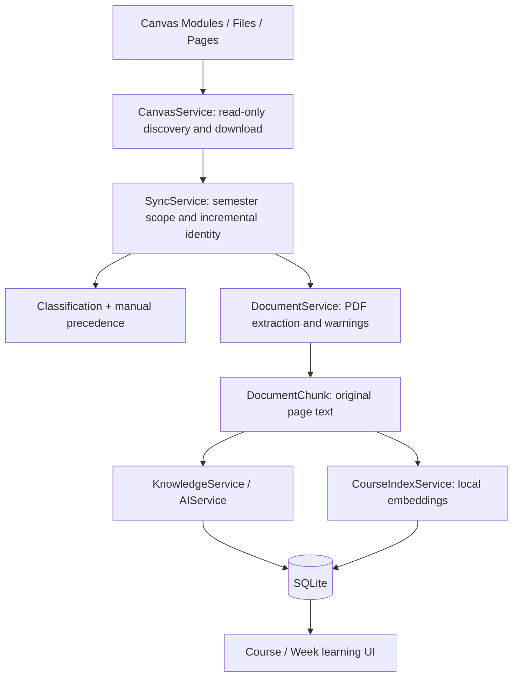

# Architecture

StudyFlow is a local single-user application: Next.js frontend, FastAPI backend, one SQLite database. It extends existing services without a new indexing worker or vector database.

## Material processing

Reading/reference filtering is separate from lecture/tutorial/other roles. Canvas file identity avoids duplicates across discovery paths. Normal sync targets the active semester; historical courses remain stored.

Classification starts from metadata. When uncertain, it can inspect bounded existing text. Optional LLM classification is explicitly budgeted in maintenance tooling; normal sync does not enable that paid fallback. Manual choices win, including at persistence time.

## Data ownership

| Data | Representation |
|---|---|
| Catalog / original identity | Semester → Course → Week → Resource |
| Primary retrieval evidence | DocumentChunk: resource_id, page_number, chunk_index, content |
| Parsing health | Resource report tied to source identity; original PDF is authoritative |
| Generated learning content | ResourceKnowledge JSON and Summary / Concept / Question projections |
| Vectors | ChunkEmbedding joined to Course through the resource graph |
| Work status | SyncRecord and Course.indexing_report |

Vectors store hashes and model/version metadata, not duplicated source text. Additive SQLite upgrades preserve records. Committed incremental batches prevent one failed operation from erasing successful material processing.

## Service boundaries

Frontend `/api` requests proxy to FastAPI. Routers delegate business workflows to services; repositories/SQLAlchemy handle persistence. CanvasService communicates/downloads but does not parse or generate knowledge. Business services use LLMProvider instead of direct vendor SDK calls.

Course Q&A uses the [RAG pipeline](rag-pipeline.md) over the live shared index, never generated summaries as primary evidence. Embedding/reranking run locally; generation uses the configured external provider. Keys remain server-side.

See [indexing](multi-course-indexing.md) for compatibility/concurrency and [limitations](limitations.md) for deployment boundaries.
