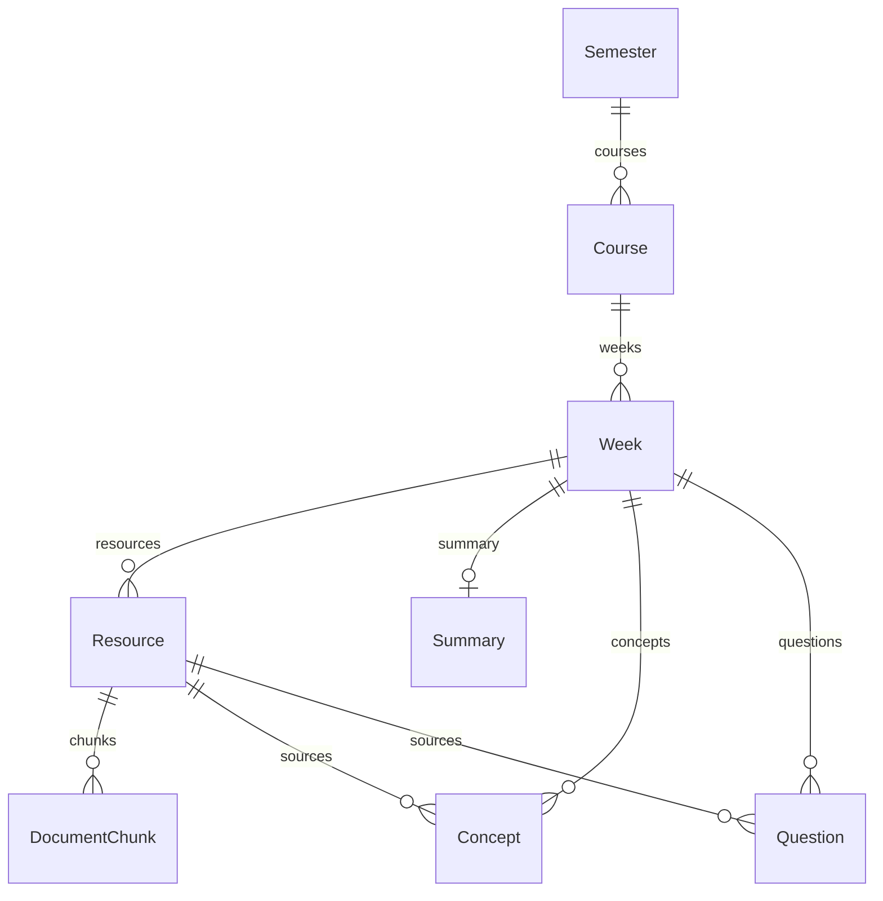

# Phase 2 数据库基础

默认文件：项目根目录 `data/studyflow.db`。`DATABASE_URL` 从环境变量或根目录 `.env` 加载；相对路径始终从项目根目录解析。

## 层次与职责

`API → repositories → SQLAlchemy Session → SQLite`。

- `core/config.py`：配置加载。
- `core/database.py`：Base、engine factory、Session factory、`get_db`、`init_db`。
- `main.py`：app factory 和 lifespan，只负责组织初始化与释放资源。
- `models/`：实体与数据库约束。
- `schemas/`：每个实体的 Create / Read，使用 `from_attributes=True`；无循环嵌套响应。
- `seed.py`：显式开发数据，独立于启动逻辑。

每个 HTTP 请求通过 FastAPI DI 得到独立 Session，退出时关闭并回滚未提交事务。写入调用方负责显式 commit；seed 使用事务上下文。应用导入时不建立数据库连接，测试可注入独立 engine。

## 关系

SyncRecord 独立记录同步运行，不强制挂到某门课程。

## 完整字段

所有表使用整数主键 `id`。`?` 表示可空；其余字段非空。字符串长度也在 Create schema 中校验，SQLite 本身不强制 VARCHAR 长度。

| Model / Table | 字段（除 id） |
| --- | --- |
| Semester / semesters | name, year, term, created_at |
| Course / courses | semester_id, canvas_course_id?, code, name, created_at, updated_at |
| Week / weeks | course_id, week_number, title, created_at, updated_at |
| Resource / resources | week_id, canvas_file_id?, filename, file_type, local_path?, canvas_updated_at?, sync_status, created_at, updated_at |
| DocumentChunk / document_chunks | resource_id, page_number, chunk_index, content, created_at |
| Summary / summaries | week_id, overview, key_points(JSON), exam_focus(JSON), created_at, updated_at |
| Concept / concepts | week_id, resource_id, name, definition, explanation, importance, source_page?, created_at |
| Question / questions | week_id, resource_id, question, answer, source_page?, created_at |
| SyncRecord / sync_records | started_at, completed_at?, status, courses_processed, files_discovered, files_downloaded, files_updated, files_skipped, files_failed, error_message? |

## 约束与存储约定

- 学期 `(year, term)` 唯一，year 为正整数。
- Course 的非空 `canvas_course_id` 全局唯一，按单用户、单 Canvas 实例设计。未关联 Canvas 时允许 NULL。
- Week 的 `(course_id, week_number)` 唯一，week_number 从 1 开始。
- Resource 的 `(week_id, canvas_file_id)` 唯一。Canvas 同一文件可出现在不同周；此时有多个资源引用。索引支持未来跨周查找同一 Canvas 文件；本阶段不实现下载缓存或同步。
- `canvas_updated_at` 用于未来版本比较，未获取元数据时为 NULL。`local_path` 未下载时为 NULL，后续约定保存相对项目根目录的路径。
- DocumentChunk 的 `(resource_id, chunk_index)` 唯一，chunk_index 在整个资源内从 0 开始递增；page_number 从 1 开始，表示该 chunk 的来源起始页。
- 一个 Week 最多一个 Summary。key_points 和 exam_focus 是字符串 JSON 数组，空内容使用 `[]`；MutableList 会跟踪 append 等原地修改。
- Concept / Question 的 `(resource_id, week_id)` 复合外键确保来源资源属于同一周。来源资源必填，source_page 可空以表示尚未确定，不能用 0 假装有效来源。
- sync_status：pending / downloaded / parsed / processing / completed / failed，默认 pending。
- importance：low / medium / high，默认 medium。
- SyncRecord.status：running / completed / completed_with_errors / failed，默认 running；计数非负，默认 0；结束时间不得早于开始时间。这里只存储状态，不实现状态流转业务。
- 枚举和数字范围由数据库 CHECK 约束保护；各连接启用 `PRAGMA foreign_keys=ON`。未配置级联删除，父记录存在子记录时不能直接删除。
- Python 与 API 使用带时区 UTC；SQLite 保存 UTC 时间值，读取时恢复 UTC 时区。拒绝写入不带时区的时间。created_at、updated_at 和默认状态由 SQLAlchemy 写入，updated_at 在 ORM 更新时自动更新，不是数据库 trigger。

## 初始化与限制

在 backend 运行 `python -m app.init_db`，或启动 FastAPI，都会创建缺失表。`create_all()` 本身不迁移已有表字段；Phase 6 的 `core/schema_upgrade.py` 在建表前执行下面列出的幂等 SQLite 增量升级，无需手动 SQL。仍未引入 Alembic。

## Phase 6 增量字段与同步约定

- `weeks.canvas_module_id`：nullable INTEGER；唯一索引 `(course_id, canvas_module_id)`，无数字名称也有稳定 Canvas 身份。`week_number` 继续满足原有唯一性与正数约束，名称保留 Canvas 原文。
- `resources.sync_stage`：nullable VARCHAR(20)，保存下一步 `download` / `parse` / `knowledge`，以及 `done` / `unsupported`。原 `sync_status` 枚举不变。
- `sync_records.details`：JSON，旧行默认 `{}`；新记录包含 scope、dry_run、files_parsed、files_analyzed、events、errors 和 usage。
- 同步器在所有 Resource 中按 `canvas_file_id` 查找，仅创建一个规范资源；同一个文件在多个 Module 出现时按首次关联去重，不重复下载。旧 schema 的跨 Week 多资源记录仍保留，若出现多个相同 Canvas ID，记录 discovery failure，避免猜测或覆盖。
- 同步流程比较 Canvas 文件更新时间。来源更新后旧知识不会成为当前结果；历史 canonical JSON 保留。过期的兼容 Concept/Question 投影在更新时移除，Summary 重建时只纳入当前资源结果。
- 三个增量字段只做添加，不修改历史 payload、chunks 或 PDFs。开发库升级前已备份到本地忽略目录 `data/phase6-validation/pre-phase6.db`。新数据库直接由模型建表；重复初始化通过测试。

以上 Phase 6 约定取代上文 Phase 2 的“仅存状态、不执行同步”说明。业务细节见 [Sync workflow](sync.md)。

实现参考：[SQLAlchemy SQLite 文档](https://docs.sqlalchemy.org/en/20/dialects/sqlite.html)、[SQLAlchemy 约束文档](https://docs.sqlalchemy.org/en/20/core/constraints.html)。
